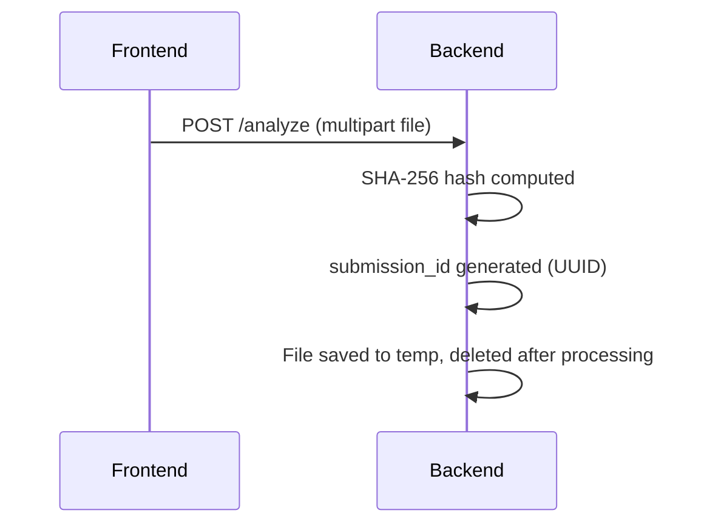
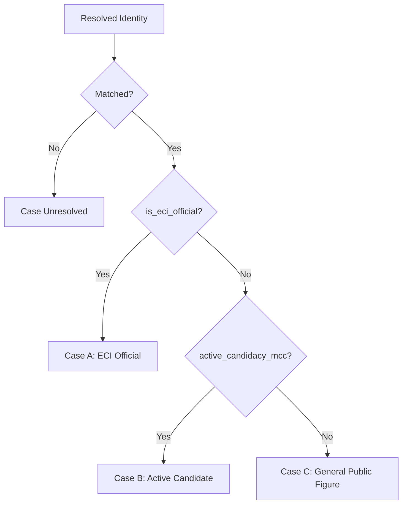
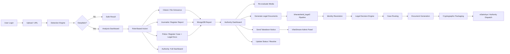

# BharatShield — Complete Application Flow

> **Detection → Content Classification → Evidence Report → Authority Routing**

---

## Overview

BharatShield is a unified deepfake detection and legal response platform. It ingests media (images, videos, audio), runs multi-modal AI analysis, classifies content, generates court-ready legal documents, and routes cases to appropriate authorities.

**Tech Stack:**
- **Frontend:** Next.js (React) + Tailwind CSS + shadcn/ui
- **Backend API:** FastAPI (Python) on port 8000
- **Legal Pipeline:** Standalone FastAPI on port 8000 (bharatshield_legal2)
- **Database:** MongoDB (async via Motor) + GridFS for media, SQLite for legal dispatch
- **Models:** EfficientNet/Xception CNN, DCT-based FFT, AASIST audio, R3D-18 temporal
- **Biometric Vector DB:** Qdrant (mock fallback)
- **Auth:** MongoDB-backed authorized_ids collection

---

## Phase 1: Detection

### Entry Points

| Method | Frontend Action | Backend Endpoint |
|--------|---------------|------------------|
| File Upload | `UploadScreen` → drop/select file | `POST /analyze` |
| URL Submission | `UploadScreen` → paste URL → download | `POST /analyze` |
| CLI Pipeline | `python main_pipeline.py --input_path <file>` | Direct (no server) |
| Demo/Analysis-only | `POST /analyze` | FastAPI `main.py` |
| Legacy Flask | `app.py` (deprecated) | Flask on port 5000 |

### Authentication Flow

```
LoginPage (frontend)
  → POST /verify-login { role, identifier }
  → MongoDB: authorized_ids collection
  → Returns { valid, user: { role, official_id, name, organization } }
```

Four roles: **Citizen**, **Journalist**, **Police**, **Authority**

### Media Ingestion



### Deepfake Detection Pipeline

#### For Images (`POST /analyze` when ext in IMAGE_EXTENSIONS)

1. **Face Crop** — detect face, crop region
2. **Spatial CNN Stream** — EfficientNet/Xception on pixel-level artefacts
   - Returns: `cnn_prediction`, `cnn_probability`
3. **Frequency (FFT) Stream** — 2D FFT + DCT spectrum analysis
   - Detects upsampling grid artefacts, frequency-domain anomalies
   - Returns: `fft_prediction`, `fft_probability`
4. **Fusion Ensemble** — Logistic regression / weighted fusion of CNN + FFT scores
   - Returns: `fusion_prediction`, `fusion_probability`, `confidence`
5. **Reliability & OOD** — Out-of-distribution detection flags
   - Returns: `reliability`, `ood_flags`

#### For Videos (`POST /analyze` when ext in VIDEO_EXTENSIONS)

1. **Frame Extraction** — 1 fps, min 4 max 32 frames
2. **Per-frame Image Analysis** — runs spatial CNN + FFT on each frame
   - Returns: `average_fake_prob`, `frames_analyzed`
3. **Audio Extraction** — FFmpeg (pcm_s16le, 16kHz, mono)
4. **Audio Analysis** — AASIST anti-spoofing model (RawNet2)
   - Returns: `audio fake_prob`, `label`
5. **Fact-Check Pipeline** — Whisper transcription → claim extraction → DuckDuckGo/NEWSAPI verification
   - Returns: `claims[]`, `overall_misinfo_risk`
6. **Multimodal Fusion** — `max(visual_prob, audio_prob)` — sensitive to either manipulation

#### For Audio (`POST /analyze` or `main_pipeline.py` with `--media_type audio`)

1. **Audio Forensics** — AASIST/RAW network for synthetic voice detection
2. **Fact-Check Pipeline** — Whisper → claim verification

#### For CLI Pipeline (`main_pipeline.py`)

```
main_pipeline.py
  ├── 1. Hashing & Identity (SHA-256, submission_id)
  ├── 2. Image Pipeline  (if image) → CNN + FFT + Fusion
  ├── 3. Audio Pipeline  (if audio) → audio_predict + factcheck
  ├── 4. Video Pipeline  (if video) → frames → image pipeline + audio extraction → factcheck
  ├── 5. Metadata & Logging → JSON report + audit_chain.jsonl
  └── 6. Output → final_report.json
```

### Key Model Files

| Model | Path (DEFAULT_*) | Type |
|-------|------------------|------|
| CNN | `DEFAULT_CNN_MODEL` | EfficientNet/Xception |
| FFT | `DEFAULT_FFT_MODEL` | Frequency-domain CNN |
| Fusion Bundle | `DEFAULT_FUSION_BUNDLE` | JSON with thresholds, weights |
| Audio | `audio_analysis/audio_detector.py` | AASIST / RawNet2 |
| Fact-Check | `factcheck/pipeline.py` | Whisper + DuckDuckGo + NewsAPI |

### Frontend Analysis Display

```
AnalysisResult component:
  ├── Main Verdict Banner (Likely Synthetic / Likely Authentic)
  ├── Confidence Radial Gauge (0-100%)
  ├── Multi-Stream Forensic Grid (5 streams):
  │   ├── Spatial Stream (SRM Noise Forensics)
  │   ├── Frequency Stream (2D FFT DCT)
  │   ├── Temporal Stream (R3D-18 inter-frame)
  │   ├── Acoustic Stream (Voice Synthesis RawNet2)
  │   └── Liveness Stream (rPPG Pulse Tracking)
  ├── Media Preview with Grad-CAM
  ├── BSA Sec.63 Chain of Custody indicator
  └── Fact-Check Panel (claim verification)
```

---

## Phase 2: Content Classification

### Verdict Determination

| Attribute | Values | Source |
|-----------|--------|--------|
| `prediction` / `final_prediction` | `"Fake"` or `"Real"` | Fusion ensemble |
| `confidence` | 0.0 to 1.0 | Calibrated fusion score |
| `risk_level` / `reliability` | `"LOW"`, `"MEDIUM"`, `"HIGH"`, `"CRITICAL"` | CNN prediction reliability |
| `cnn_probability` | 0.0 to 1.0 | Spatial texture stream |
| `fft_probability` | 0.0 to 1.0 | Frequency domain stream |
| `fusion_probability` | 0.0 to 1.0 | Ensemble fusion |
| `ood_flags` | `[]` | Out-of-distribution detection |

### Risk Tier Tags

```
risk_level → UI color mapping:
  CRITICAL / HIGH → red-500
  MEDIUM          → amber-500
  LOW             → blue-500
  (authentic)     → emerald-500
```

### Fact-Check Classification

```
fact_check:
  ├── available: true/false
  ├── overall_misinfo_risk: "HIGH" | "LOW"
  └── claims[]:
      ├── claim: text
      ├── speaker: string
      ├── verdict: "FALSE" | "MISLEADING"
      ├── explanation: string
      ├── confidence: number
      └── sources[]:
          ├── title: string
          ├── url: string
          └── snippet: string
```

### Metadata Response Structure

Full response from `/analyze`:

```json
{
  "submission_id": "BS-...",
  "file": { "name", "size_bytes", "media_type", "sha256" },
  "deepfake_detection": {
    "label": "Fake",
    "confidence": 0.92,
    "risk_level": "HIGH",
    "is_deepfake": true,
    "fake_probability": 0.92,
    "streams": { "spatial_texture", "frequency_domain", "temporal", "audio", "rppg" },
    "processing_ms": 120
  },
  "fact_check": { "available", "overall_misinfo_risk", "claims" },
  "integrity": { "sha256", "audit_entry" }
}
```

---

## Phase 3: Evidence Report

### Report Submission (Frontend → Backend)

After analysis, the **RoleBasedOutput** component allows each role to take action:

| Role | Action | Backend Call |
|------|--------|-------------|
| Citizen | File Grievance Report | `POST /api/reports/submit` |
| Journalist | Register & Secure Case ID | `POST /api/reports/submit` |
| Police | Register Official Case + Generate Legal Docs | `POST /api/reports/submit` → `POST /api/reports/{id}/generate-legal-docs` |
| Authority | Register Case → Navigate to Authority Dashboard | `POST /api/reports/submit` |

### Report Service (`backend/report_service.py`)

```
POST /api/reports/submit
  ├── reporter_role, reporter_identifier, reporter_name
  ├── analysis_json (full detection result)
  ├── file (optional, stored in MongoDB GridFS)
  └── Returns: { report_id: "BS-10234", status: "pending_review" }
```

MongoDB Document Schema (`reports` collection):

```json
{
  "report_id": "BS-10234",
  "reporter": { "role", "identifier", "name" },
  "analysis": { /* full detection output */ },
  "media_file_id": "GridFS ObjectID or local:path",
  "media_hash": "sha256",
  "media_filename": "file.ext",
  "status": "pending_review",
  "legal_documents": [],
  "created_at": "ISO datetime",
  "updated_at": "ISO datetime",
  "reanalysis_history": [],
  "custody_log": [
    { "time": "...", "event": "Report submitted", "actor": "..." },
    { "time": "...", "event": "SHA-256 hash verified", "actor": "System" },
    { "time": "...", "event": "Evidence locked in MongoDB GridFS", "actor": "System" }
  ],
  "takedown_status": null,
  "takedown_response": null,
  "admin_notes": null
}
```

### Legal Document Generation (`backend/legal_integration.py`)

```
POST /api/reports/{report_id}/generate-legal-docs
  → Maps analysis results → bharatshield_legal2 pipeline
  → Generates PDF documents
  → Stores references in report.legal_documents[]
  → Returns: { documents: [{ document_type, filename, packet_id }] }
```

Mapping from detection results to legal payload:

| Analysis Field | Legal Schema Field |
|---------------|--------------------|
| `cnn_probability` | `visual.spatial_cnn_manipulation_probability` |
| `fft_probability` | `visual.face_mesh_landmark_variance` (approx) |
| `confidence` | `risk.synthetic_confidence` |
| `prediction` | Drives acoustic/visual offsets |

### Legal Pipeline (`bharatshield_legal2/`)

```
bharatshield_legal2 main.py - POST /api/v1/generate-legal-packet
  │
  ├── Module 1: Ingestion (LegalPacketRequest schema)
  │   ├── system metadata (analyst_id, MAC, serial)
  │   ├── file metadata (filename, hash, size)
  │   ├── visual forensics (CNN, lip-sync, face mesh)
  │   ├── acoustic forensics (TTS prob, pitch mismatch, anti-spoofing)
  │   ├── biometrics (ArcFace 512D + ECAPA 256D embeddings)
  │   ├── risk indicators (NCII, harassment, synthetic_confidence)
  │   └── target input (politician name, role, party, constituency)
  │
  ├── Module 2: Identity Resolution (resolver.py)
  │   ├── BiometricContextResolver
  │   ├── ArcFace visual → Qdrant face collection
  │   ├── ECAPA voice → Qdrant voice collection
  │   ├── SELFI fusion (forgery-aware identity adapter)
  │   ├── Cosine similarity threshold matching
  │   └── Returns: ResolvedIdentity (matched, profile, electoral context)
  │
  ├── Module 3: Legal Decision Engine (engine.py)
  │   ├── Case A: ECI Official → MCC violation, Art.324, BNS 319
  │   ├── Case B: Active Candidate → RPA 123(4), BNS 356, BNS 336
  │   ├── Case C: General Public Figure → BNS 319, 336, 356
  │   └── Case Unresolved: Identity below threshold → generic cyber crime
  │
  ├── Module 4: Document Generation (generator.py + pdf_render.py)
  │   ├── BSA Section 63 Part A (Digital Evidence Certificate)
  │   ├── BSA Section 63 Part B (Hash-Certified Evidence)
  │   ├── ECI Contempt Notice / RPA Complaint
  │   ├── IT Rules 2026 Intermediary Takedown Notice (2h or 3h)
  │   ├── Draft FIR (BNS)
  │   ├── Cyber Crime FIR
  │   └── Complete Legal Evidence Packet
  │
  ├── Module 5: Cryptographic Packaging (secure_log.py)
  │   ├── EvidentiaryPacketCompiler
  │   ├── ZIP packaging (media + PDFs + manifest)
  │   ├── SHA-256 sealing
  │   ├── JSON-LD immutable audit chain
  │   ├── eSakshya metadata (16-digit SID)
  │   └── Returns: EvidentiaryPackage (zip_path, zip_sha256, audit_log)
  │
  └── Module 6: Authority Reporting (reporting.py)
      ├── SQLite persistence
      ├── AUTHORITY_DISPATCH_MATRIX per case type
      ├── Creates dispatch_log entries per channel
      └── Returns: AuthorityReport (id, status: pending_review)
```

### Legal PDF Documents (`legal.py` — standalone PDF generator)

The standalone `legal.py` generates 6 court-ready PDFs in a single package:

| # | Document | Legal Basis |
|---|----------|-------------|
| 1 | **Digital Evidence Package** | BSA 2023 Section 63 |
| 2 | **Platform Takedown Notice** | IT Rules 2021 Rule 3(1)(b) |
| 3 | **FIR Support Report** | IPC 499, 153A · IT Act 66C/D/E |
| 4 | **Chain of Custody Log** | BSA 2023 Append-Only Ledger |
| 5 | **Regulatory Compliance Report** | MeitY / ECI Submission |
| 6 | **Expert Witness Statement** | Judicial Proceedings |

### Frontend Evidence & Document Views

| Component | Purpose |
|-----------|---------|
| `analysis-result.tsx` | Main detection verdict with 5-stream grid, Grad-CAM, fact-check |
| `role-based-output.tsx` | Role-specific action panel (Citizen → grievance, Police → case registration + legal docs) |
| `action-confirmation.tsx` | Post-submission success screen with case ID, live tracker, document downloads |
| `my-reports.tsx` | User's submitted reports with custody timeline, legal document downloads (role-filtered) |
| `authority-dashboard.tsx` | Full case directory with re-evaluation, legal doc generation, takedown notice, status updates |

---

## Phase 4: Authority Routing

### Case Type Routing (`bharatshield_legal2/engine.py`)

The LegalDecisionEngine routes based on **ResolvedIdentity**:



### Dispatch Matrix (`bharatshield_legal2/reporting.py`)

Each case type maps to specific authority channels:

#### Case A: ECI Official

| Channel | Medium | Contact |
|---------|--------|---------|
| Election Commission of India | ECI Online Complaint Portal + Registered Post | complaints@eci.gov.in |
| Intermediary Email | Email to Grievance Officer (3-hour notice) | Statutory PDF |
| eSakshya Portal | MHA ICJS Web Portal Upload | 16-digit SID |
| Admin Queue | Internal BharatShield Admin Panel | Supervisor approval |

#### Case B: Active Candidate

| Channel | Medium | Contact |
|---------|--------|---------|
| ECI | Section 123(4) RPA Complaint | complaints@eci.gov.in |
| Local Police FIR | CCTNS-compatible FIR → District Cyber Cell | 1930 Helpline |
| Intermediary Email | Platform takedown (3-hour window) | Automated notice |
| Admin Queue | Internal review | Supervisor approval |

#### Case C: General Public Figure

| Channel | Medium | Contact |
|---------|--------|---------|
| NCRP | National Cyber Crime Reporting Portal | 1930 / cybercrime.gov.in |
| Local Police FIR | Jurisdictional police station (CCTNS) | Station House Officer |
| Intermediary Email | Platform notice (2h for NCII, 3h standard) | Platform compliance |
| Admin Queue | Internal review | Internal |

#### Case Unresolved (Identity Unknown)

| Channel | Medium | Contact |
|---------|--------|---------|
| NCRP | Identity-agnostic cyber complaint | 1930 |
| Admin Queue | Mandatory admin review before dispatch | Forensic supervisor |

### Authority Dashboard Workflow (`frontend/components/authority-dashboard.tsx`)

```
AuthorityDashboard
  │
  ├── Case Directory (left panel)
  │   ├── Search by case ID / media name
  │   ├── Filter by status (all, pending, in progress, resolved, dismissed)
  │   └── Click to select case → loads details
  │
  └── Case Detail Panel (right panel)
      │
      ├── Ingested Media info (filename, SHA-256, GridFS ID)
      ├── Submitter Details (role, identifier, name)
      ├── AI Neural Inferences (ensemble verdict, confidence, spatial/FFT scores)
      │
      ├── Re-evaluate Media → POST /api/reports/{id}/reanalyze
      │   └── Re-downloads media from GridFS, re-runs detection
      │
      ├── Generate Legal Notice → POST /api/reports/{id}/generate-legal-docs
      │   └── Triggers legal_integration.py → bharatshield_legal2 pipeline
      │
      ├── Legal Document Downloads (per document download links)
      │
      ├── VibeStream Content Takedown → POST /api/reports/{id}/send-takedown
      │   └── Sends to VibeStream admin panel via HTTP POST
      │
      ├── Auditable Custody Log (timestamped event chain)
      │
      └── Administrative Resolution
          ├── Status update dropdown (pending_review / under_investigation / resolved / dismissed)
          ├── Resolution notes input
          └── Apply Resolution → PATCH /api/reports/{id}/status
```

### API Route Summary

| Method | Endpoint | Purpose |
|--------|----------|---------|
| POST | `/analyze` | Main media analysis endpoint |
| POST | `/verify-login` | Role-based authentication |
| POST | `/predict/video` | Legacy video prediction |
| POST | `/api/reports/submit` | Submit deepfake report (multipart) |
| POST | `/api/reports/submit-json` | Submit report (JSON body) |
| GET | `/api/reports` | List reports (filtered by role) |
| GET | `/api/reports/{id}` | Get single report detail |
| PATCH | `/api/reports/{id}/status` | Update report status |
| POST | `/api/reports/{id}/reanalyze` | Re-run detection on stored media |
| POST | `/api/reports/{id}/generate-legal-docs` | Generate legal PDF documents |
| GET | `/api/reports/{id}/documents/{packet_id}/{filename}` | Download legal document PDF |
| POST | `/api/reports/{id}/send-takedown` | Send takedown to VibeStream |

### VibeStream Integration

The VibeStream demo platform (`vibestream-demo/`) provides an admin panel where takedown notices are received. The flow:

```
BharatShield Authority Dashboard
  → POST /api/reports/{id}/send-takedown
  → Backend builds payload with case_id, media_hash, legal_packet_id, prediction, confidence
  → HTTP POST to VibeStream backend at localhost:4001/api/takedown
  → VibeStream admin displays takedown for review
  → Takedown status tracked in MongoDB report
```

---

## End-to-End Flow Diagram



---

## File Map

```
unysis-unofficial/
├── frontend/                    # Next.js Frontend
│   ├── app/
│   │   ├── page.tsx             # Main app with screen routing
│   │   ├── layout.tsx           # Root layout with metadata
│   │   └── globals.css          # Global styles
│   ├── components/
│   │   ├── login-page.tsx       # Role-based authentication
│   │   ├── landing-page.tsx     # Hero + actions
│   │   ├── upload-screen.tsx    # File/URL upload + processing
│   │   ├── analysis-result.tsx  # 5-stream forensic dashboard
│   │   ├── role-based-output.tsx # Role-specific actions
│   │   ├── action-confirmation.tsx # Post-submission success
│   │   ├── authority-dashboard.tsx # Full case management
│   │   ├── my-reports.tsx       # User report history
│   │   └── metrics-dashboard.tsx # Platform metrics
│   └── src/api.ts              # API client functions
│
├── backend/                    # FastAPI Backend
│   ├── main.py                 # FastAPI app + all endpoints
│   ├── app.py                  # Deprecated Flask app
│   ├── report_routes.py        # Report CRUD + legal + takedown
│   ├── report_service.py       # MongoDB + GridFS persistence
│   ├── legal_integration.py    # Bridges analysis → legal pipeline
│   ├── ml/                     # Model loading, inference, config
│   └── utils/                  # metadata, legal helpers
│
├── bharatshield_legal2/        # Legal Document Generation
│   ├── main.py                 # Legal pipeline FastAPI
│   ├── schemas.py              # Pydantic models for all stages
│   ├── engine.py               # Rule-based legal routing
│   ├── resolver.py             # Biometric identity (Qdrant)
│   ├── identity_merge.py       # Biometric + user override merge
│   ├── explanation.py          # Plain-language deepfake explanations
│   ├── generator.py            # PDF document orchestration
│   ├── pdf_render.py           # PDF rendering logic
│   ├── secure_log.py           # Cryptographic ZIP + audit chain
│   ├── reporting.py            # Authority dispatch matrix + SQLite
│   ├── config.py               # Legal pipeline config
│   └── dummy_data.py           # Demo payloads
│
├── main_pipeline.py            # CLI multimodal pipeline
├── image_inference.py          # CNN + FFT + Fusion inference
├── audio_inference.py          # Audio detection inference
├── factcheck_inference.py      # Fact-checking pipeline
├── legal.py                    # Standalone 6-doc PDF generator
├── config.py                   # Global configuration
├── metadata_analysis/          # SHA-256 hashing, metadata, audit
├── audio_analysis/             # AASIST audio detector
├── factcheck/                  # Whisper transcription + claim verif.
├── fft/                        # FFT model, training, fusion
├── ml_pipeline/                # Training pipeline
└── MesoNet/                    # MesoNet model variant
```

---

## Key Configuration

| Variable | Default | Description |
|----------|---------|-------------|
| `FAKE_THRESHOLD` | 0.50 | Detection confidence threshold |
| `MONGO_URI` | (from .env) | MongoDB connection string |
| `NEWSAPI_KEY` | (from .env) | Fact-check news source |
| `WHISPER_MODEL` | small | Whisper model size |
| `SYSTEM_NAME` | BharatShield Deepfake Detection System | Legal document branding |
| `LEGAL_AUTHORITY` | IT Rules 2021 (India) / BSA Section 63 | Governing law |
