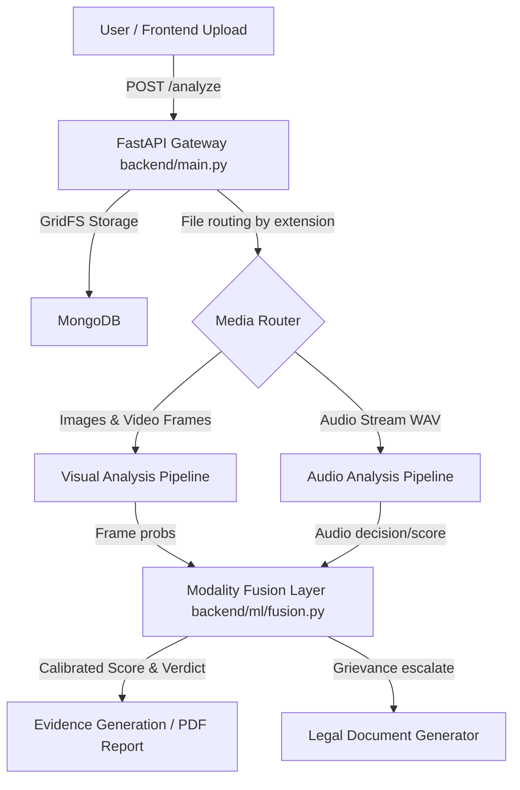
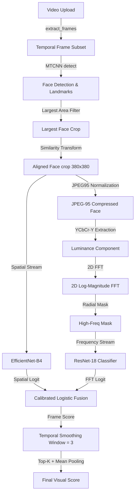
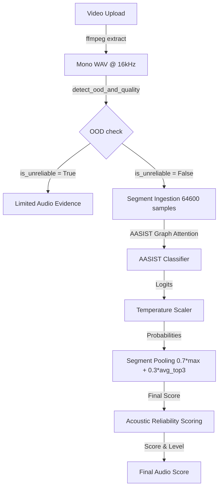
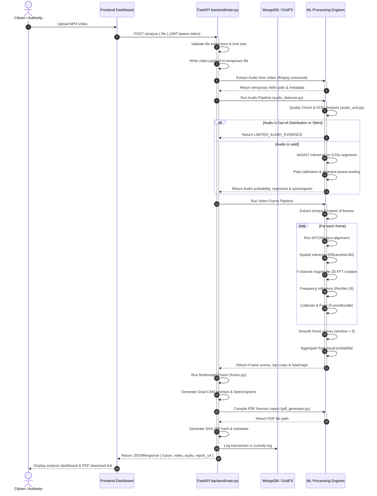

# BharatShield: Multimodal Deepfake Detection Architecture

This document provides a comprehensive, production-grade reverse-engineered technical specification of the BharatShield audio-video deepfake detection pipeline. It outlines the end-to-end processing layers from the frontend interfaces, through the backend ingestion mechanisms, down to the visual, acoustic, and decision fusion models.

---

## 1. System Overview

The system employs a decentralized, multimodal architecture designed to ingest, process, verify, and catalog suspected deepfake files (videos, standalone audio, and images). It runs on a unified FastAPI backend paired with a Next.js frontend, backed by a MongoDB/GridFS storage layer for evidence custody.



### Major Components and Data Flow

1. **Frontend Layer (Next.js):** 
   Provides user interactions for file upload, analysis result rendering (Grad-CAM heatmaps, suspicious frame timelines), and legal notice escalation. Communicates with the backend using JWT-authenticated API requests.
2. **Backend Gateway (FastAPI in `backend/main.py`):**
   Handles request routing, payload validation, file-size enforcement, temporary file writes, and database/GridFS coordination.
3. **Persistence and Custody (MongoDB & GridFS in `report_service.py`):**
   Stores report metadata, auditable custody logs, re-evaluation history, and legal PDF packages. Heavy binary media (videos/audio) are written directly into a MongoDB GridFS bucket (`report_media`).
4. **Visual Pipeline (`image_inference.py` & `test_cnn.py`):**
   Executes face detection, landmark alignment, spatial texture evaluation (EfficientNet-B4), and frequency-domain artifact scanning (FFT + ResNet18).
5. **Acoustic Pipeline (`backend/ml/audio_detector.py` & `audio_analysis/audio_detector.py`):**
   Extracts audio streams from video containers, evaluates audio quality/OOD flags, and passes raw waveforms to graph attention models (AASIST) or fallback 1D CNNs (RawNet2).
6. **Decision Layer (`backend/ml/fusion.py`):**
   Fuses visual and acoustic scores using dynamic, quality-weighted linear pooling.
7. **Legal Compliance (`legal_integration.py` & `pdf_generator.py`):**
   Compiles comprehensive compliance notices, expert certification PDFs, and evidence packets on the server.

---

## 2. Video Deepfake Detection Pipeline

The video pipeline extracts representative frames, aligns faces, processes them through dual-stream spatial/frequency neural networks, and generates a combined visual score.



### Step-by-Step Stage Processing

#### 2.1 Frame Extraction (`main_pipeline.py:extract_frames`)
* **Input:** Video path (`.mp4`, `.avi`, `.mov`, `.mkv`, `.webm`).
* **Processing:** Uses OpenCV `cv2.VideoCapture` to compute total frames and FPS. It samples a temporal subset dynamically based on video duration:
  $$\text{Sample Count} = \text{max}\left(4, \text{min}\left(\lfloor\text{Duration (seconds)}\rfloor, 32\right)\right)$$
  Frames are selected symmetrically along a linear space (`torch.linspace`) and saved as temporary JPEGs.
* **Output:** List of temporary frame image file paths.

#### 2.2 Face Detection & Alignment (`test_cnn.py:detect_and_align_face`)
* **Input:** RGB Pil image.
* **Processing:**
  1. **MTCNN Detection:** Runs MTCNN with `image_size=160`, `min_face_size=20`, `thresholds=[0.6, 0.7, 0.7]`, and `factor=0.709` to detect bounding boxes and 5-point facial landmarks (left eye, right eye, nose, left mouth corner, right mouth corner).
  2. **Face Selection Strategy:** Filters bounding boxes by area. The face with the largest area:
     $$\text{Area} = (x_2 - x_1) \times (y_2 - y_1)$$
     is selected.
  3. **Cropping Margin:** Adds a 30% margin around the face box:
     $$\text{New Width} = w_{\text{box}} \times 1.6, \quad \text{New Height} = h_{\text{box}} \times 1.6$$
  4. **Affine Transformation:** The 5-point landmarks are matched against a standard $112\times112$ template scaled to $380\times380$ using OpenCV's partial affine estimator `cv2.estimateAffinePartial2D`.
  5. **Warping:** Warps the face crop to $380\times380$ pixels using `cv2.warpAffine` with `cv2.INTER_LINEAR` and `cv2.BORDER_REFLECT_101`.
* **Output:** Aligned $380\times380$ face crop as a numpy array.

#### 2.3 Image Preprocessing & Spatial CNN (`test_cnn.py:preprocess_image`)
* **Input:** Aligned face crop.
* **Processing:** Validates crop dimensions. The face crop is passed through ImageNet normalization transform (`IMAGENET_MEAN = [0.485, 0.456, 0.406]`, `IMAGENET_STD = [0.229, 0.224, 0.225]`).
* **Model Inference (`EfficientNetB4Binary`):** The normalized tensor is fed into an EfficientNet-B4 feature extractor followed by a custom classification head:
  ```python
  self.head = nn.Sequential(
      nn.AdaptiveAvgPool2d(1),
      nn.Flatten(),
      nn.Dropout(0.5),
      nn.Linear(in_features, 512),
      nn.GELU(),
      nn.Dropout(0.3),
      nn.Linear(512, 1) # Outputs a raw spatial logit
  )
  ```
* **Output:** Spatial raw logit ($L_{\text{cnn}}$) and sigmoid probability ($P_{\text{cnn}}$).

#### 2.4 Frequency-Domain FFT Pipeline (`fft_preprocess.py`)
* **Input:** Aligned face crop (numpy array).
* **Processing:**
  1. **JPEG Normalization:** The face crop is saved as a JPEG with `quality=95` and `subsampling=0` to normalize compression and remove noise artifacts.
  2. **Luminance Extraction:** The JPEG is reloaded and converted to YCbCr space; the Y-channel (luminance component) is extracted.
  3. **2D Discrete Fourier Transform:** Performs 2D Fast Fourier Transform and shifts zero-frequency components to the center:
     $$S = \text{fftshift}\left(\text{fft2}\left(I_Y\right)\right)$$
  4. **Log-Magnitude Scaling:** Extract magnitude and log-scale:
     $$\text{Log Mag} = \log\left(1 + |S|\right)$$
  5. **Radial Emphasis Mask:** Applies a soft radial emphasis mask to attenuate low frequency centers and highlight high frequency generative grid anomalies:
     $$\text{Mask}(y, x) = 1.0 - \exp\left(-\left(\frac{\text{dist\_norm}}{\sigma}\right)^2\right) \quad (\sigma = 0.3)$$
  6. **Normalizing Spectrum:** Zero-mean, unit-std normalized per sample.
* **Model Inference (`FFTResNet18` in `fft_model.py`):** The 1-channel log-spectrogram is fed into a modified ResNet-18 (which has its first convolution layer averaged to support 1-channel inputs instead of 3-channel RGB).
* **Output:** Frequency raw logit ($L_{\text{fft}}$) and sigmoid probability ($P_{\text{fft}}$).

#### 2.5 Visual Decision Fusion (`image_inference.py:fuse_logistic`)
* **Input:** $L_{\text{cnn}}$ and $L_{\text{fft}}$.
* **Processing:** Passes both logits to the Platt scaling stacked logistic calibrator (`FusionBundle`).
* **Reliability/Size Gate:**
  * If the detected face bounding box width is $< 175$ pixels, FFT is skipped (to prevent interpolation/upsampling artifacts from causing false positives), falling back to CNN-only probability.
  * If the face is $\ge 175\text{px}$, logits are fused.
  * **Suppression Protection:** If $P_{\text{fft}} < 0.01$ and $P_{\text{cnn}} \ge 0.50$, the fusion is bypassed to prevent the FFT branch from suppressing positive CNN predictions.
* **Output:** Fused probability ($P_{\text{visual}}$).

#### 2.6 Frame aggregation (`backend/main.py:predict_video_endpoint`)
* **Temporal Smoothing:** Computes a moving average window of size 3 over frame probabilities:
  $$P_{\text{smoothed}, i} = \frac{1}{|W|} \sum_{j \in W_i} P_{\text{raw}, j}$$
* **Score Aggregation:** Combines weighted mean, top-K mean, and max score to construct the final visual score:
  $$P_{\text{video\_final}} = 0.65 \times \mu_{\text{weighted}} + 0.25 \times \mu_{\text{top\_k}} + 0.10 \times \text{max}(P)$$
  * $\mu_{\text{weighted}}$ is computed using frame weights derived from confidence and reliability factors (e.g. HIGH=1.0, MEDIUM=0.7, LOW=0.4).
  * $\mu_{\text{top\_k}}$ computes the average of the top $10\%$ most suspicious frames.

---

## 3. Audio Deepfake Detection Pipeline

The acoustic pipeline extracts and analyzes speech waveforms to detect signs of voice cloning, TTS synthesis, or splicing.



### Stage Implementations

#### 3.1 Audio Ingestion and Extraction (`backend/ml/audio_extractor.py:extract_audio`)
* **Input:** Video container path.
* **Processing:** Spawns a subprocess to execute `ffmpeg`, stripping the video track and encoding the audio as 16-bit PCM Mono WAV resampled to 16000 Hz:
  ```bash
  ffmpeg -y -i <video_path> -vn -acodec pcm_s16le -ar 16000 -ac 1 <audio_out_path>
  ```
* **Output:** Resampled audio file metadata dictionary.

#### 3.2 Pre-flight Check & OOD Detection (`backend/ml/audio_ood.py:detect_ood_and_quality`)
* **Input:** 1D numpy array representing raw audio waveform.
* **Processing:**
  1. **Clipping Check:** Computes ratio of samples exceeding 99% amplitude limit ($> 0.99$). ratio $> 0.05$ flags high clipping.
  2. **Silence Check:** Splits audio into 50ms frames and computes RMS energy. If RMS energy is $< 0.01$ in $> 50\%$ of the frames, high silence ratio is flagged.
  3. **SNR Estimation:** Computes Peak-to-Noise Floor energy ratio using 95th vs 5th percentiles:
     $$\text{SNR}_{\text{dB}} = 20 \log_{10}\left(\frac{\text{RMS}_{95\%} + 1e-6}{\text{RMS}_{5\%}}\right)$$
     SNR $< 10\text{dB}$ flags extremely noisy audio.
  4. **Abstention Decision:** If duration is $< 2.0\text{s}$, silence ratio is $> 90\%$, or SNR is $< 10\text{dB}$, the OOD score is set high ($\ge 0.70$), flagging the sample as unreliable.
* **Output:** Quality report dict. If `is_unreliable` is true, the pipeline immediately halts, returning a `LIMITED_AUDIO_EVIDENCE` verdict.

#### 3.3 AASIST Deepfake Inference (`backend/ml/audio_detector.py:run_aasist_inference`)
* **Input:** Filtered, resampled mono waveform.
* **Processing:**
  1. **Chunk Segmenting:** Splits waveform into chunks of `64600` samples (~4.03 seconds). Short boundary chunks are padded using replication padding (`np.tile`).
  2. **Sinc-Convolution & Graph Networks:** Chunks are passed to the `AASIST` model. A learnable Sinc-convolution frontend processes the raw waveform to extract spectral components, which are then modeled using integrated spectro-temporal graph attention networks.
  3. **Logit Calibration:** Segment logits are calibrated using `TemperatureScaler` (Platt scaling with temperature scaling):
     $$\mathbf{z}_{\text{calibrated}} = \frac{\mathbf{z}_{\text{raw}}}{T} \quad (T \approx 1.5)$$
  4. **Probabilities:** Applies Softmax to logits to calculate segment fake probabilities.
* **Segment Pooling:** Aggregates segment scores by weighting the max score and top-3 average:
  $$S_{\text{audio}} = 0.70 \times S_{\text{max}} + 0.30 \times S_{\text{avg\_top3}}$$
* **Output:** Calibrated acoustic fake probability ($S_{\text{audio}}$).

#### 3.4 Acoustic Reliability Scoring (`backend/ml/audio_reliability.py`)
* **Input:** SNR, duration, silence ratio, clipping detection, OOD score, model confidence.
* **Processing:** Starts at 100 and applies cumulative penalties:
  * Low SNR ($<10\text{dB}$): $-\text{min}(50, (10 - \text{SNR}) \times 5)$
  * Short duration ($<3.0\text{s}$): $-\text{min}(40, (3.0 - \text{duration}) \times 15)$
  * High silence ($>0.5$): $-(\text{silence\_ratio} - 0.5) \times 100$
  * Clipping detected: $-20$
  * High OOD ($>0.5$): $-(\text{ood\_score} - 0.5) \times 100$
  * Low model confidence ($<0.7$): $-(0.7 - \text{conf}) \times 100$
* **Output:** Reliability score (0-100) and level (HIGH $\ge 80$, MEDIUM $\ge 50$, LOW $< 50$).

---

## 4. Multimodal Audio-Video Fusion

Modality outputs are combined in `backend/ml/fusion.py` using quality-weighted linear pooling to calculate a final fused probability and assign classification verdicts.

### 4.1 Modality Weighting Strategy
The modality inputs are weighted based on their parsed quality assessment levels (`GOOD`, `DEGRADED`, or `UNAVAILABLE`):

$$\text{Weight}(m) = \begin{cases} 
      1.0 & m = \text{GOOD} \\
      0.5 & m = \text{DEGRADED} \\
      0.0 & m = \text{UNAVAILABLE}
   \end{cases}$$

For active modalities, normalized contribution ratios are computed:

$$C_{\text{video}} = \frac{W_{\text{video}}}{W_{\text{video}} + W_{\text{audio}}} \qquad C_{\text{audio}} = \frac{W_{\text{audio}}}{W_{\text{video}} + W_{\text{audio}}}$$

### 4.2 Fusion Core Formula
The final multimodal score is calculated as:

$$S_{\text{fused}} = \left(S_{\text{video}} \times C_{\text{video}}\right) + \left(S_{\text{audio}} \times C_{\text{audio}}\right)$$

### 4.3 Multimodal Decision Logic Matrix

| Video Verdict ($V$) | Audio Verdict ($A$) | Conditions | Final Verdict | Decision Source |
| :--- | :--- | :--- | :--- | :--- |
| **REAL** | **REAL** / `NO_STRONG_ACOUSTIC_ANOMALY` | - | **REAL** | `VIDEO + AUDIO` |
| **FAKE** | **FAKE** / `HIGH_AUDIO_SUSPICION` | - | **FAKE** | `VIDEO_PRIMARY_WITH_AUDIO_SUPPORT` |
| **FAKE** | **REAL** / `UNCERTAIN` / `LIMITED_AUDIO` | - | **FAKE** | `VIDEO_PRIMARY` |
| **REAL** | **FAKE** / `HIGH_AUDIO_SUSPICION` | Audio Quality = `GOOD`, Rel $> 70$, Conf = `HIGH` | **FAKE** | `AUDIO_DOMINANT` |
| **REAL** | **FAKE** / `HIGH_AUDIO_SUSPICION` | Audio Quality $\ne$ `GOOD` or Rel $\le 70$ | **INCONCLUSIVE** | `CONFLICT` |
| **REAL** | `UNCERTAIN` / `LIMITED_AUDIO` | - | **REAL** | `VIDEO_PRIMARY` |
| $\ne$ `NOT_ANALYZED` | `NOT_ANALYZED` | Audio unavailable | **Video Verdict** | `VIDEO_ONLY` |
| `NOT_ANALYZED` | $\ne$ `NOT_ANALYZED` | Video unavailable | **Audio Verdict** | `AUDIO_ONLY` |

---

## 5. API and Backend Execution Flow



---

## 6. File-by-File Traceability

| Stage | File Path | Function/Class Name | Purpose | Key Dependencies |
| :--- | :--- | :--- | :--- | :--- |
| **API Ingestion** | [main.py](file:///d:/forsen/backend/main.py) | `analyze` | Main API handler routing incoming media uploads. | `FastAPI`, `UploadFile` |
| **Audio Extraction** | [audio_extractor.py](file:///d:/forsen/backend/ml/audio_extractor.py) | `extract_audio` | Extracts audio stream to mono 16kHz WAV. | `subprocess` (ffmpeg), `soundfile` |
| **Audio Pre-flight** | [audio_ood.py](file:///d:/forsen/backend/ml/audio_ood.py) | `detect_ood_and_quality` | Performs clipping, silence, and SNR checks to detect anomalies. | `numpy` |
| **Audio Loading** | [audio_model_loader.py](file:///d:/forsen/backend/ml/audio_model_loader.py) | `AudioModelLoader` | Dynamically loads AASIST architecture and weights. | `importlib`, `torch` |
| **Audio Inference** | [audio_detector.py](file:///d:/forsen/backend/ml/audio_detector.py) | `analyze_audio` | Segment-aware inference pooling and spectrogram generation. | `torchaudio`, `cv2`, `AASIST` |
| **Acoustic Scoring** | [audio_reliability.py](file:///d:/forsen/backend/ml/audio_reliability.py) | `compute_audio_reliability` | Deducts quality penalties to determine confidence level. | - |
| **Visual Inference** | [image_inference.py](file:///d:/forsen/image_inference.py) | `infer_image` | Coordinates spatial and frequency models for an image. | `torch`, `FusionBundle` |
| **Face Prep** | [test_cnn.py](file:///d:/forsen/test_cnn.py) | `detect_and_align_face` | Detects largest face and runs 5-point alignment transform. | `facenet_pytorch` (MTCNN), `cv2` |
| **Spatial Model** | [train_deepfake_detection.py](file:///d:/forsen/train_deepfake_detection.py) | `EfficientNetB4Binary` | EfficientNet-B4 classifier trained with Focal Loss. | `torchvision` |
| **FFT Extraction** | [fft_preprocess.py](file:///d:/forsen/fft/fft_preprocess.py) | `preprocess_image` | Extracts luminance Y-channel and applies shifted log-FFT. | `numpy.fft` |
| **Frequency Model** | [fft_model.py](file:///d:/forsen/fft/fft_model.py) | `FFTResNet18` | ResNet-18 model modified to accept 1-channel inputs. | `torchvision` |
| **Calibration** | [confidence_calibrator.py](file:///d:/forsen/backend/ml/confidence_calibrator.py) | `TemperatureScaler` | Calibrates logits using learnable temperature scaling. | `torch.optim.LBFGS` |
| **Modality Fusion** | [fusion.py](file:///d:/forsen/backend/ml/fusion.py) | `fuse_modalities` | Implements quality-weighted linear pooling for final decision. | - |
| **Evidence Report** | [pdf_generator.py](file:///d:/forsen/backend/ml/pdf_generator.py) | `generate_pdf_report` | Compiles analysis results into a formatted PDF. | `fpdf` |

---

## 7. Model Details

### 7.1 Spatial CNN Model (`EfficientNetB4Binary`)
* **Trunk Architecture:** EfficientNet-B4 backbone pretrained on ImageNet-1K.
* **Head Architecture:** Adaptive average pooling $\rightarrow$ Flatten $\rightarrow$ Dropout (0.5) $\rightarrow$ Linear (in_features to 512) $\rightarrow$ GELU activation $\rightarrow$ Dropout (0.3) $\rightarrow$ Linear (512 to 1).
* **Inputs:** Normalized $380\times380\times3$ RGB aligned face crops.
* **Outputs:** 1D raw logit. $P_{\text{fake}} = \sigma(\text{logit})$.
* **Training Protocol:** Fine-tuned on aligned face datasets using Focal Loss with label smoothing (smoothing factor = 0.1) and MixUp regularizations to prevent overfitting.

### 7.2 Frequency FFT Model (`FFTResNet18`)
* **Trunk Architecture:** ResNet-18 adapted for single-channel inputs.
* **Modification:** The first convolutional layer is replaced with a single-channel convolution initialized by averaging the pretrained ImageNet RGB weights across the channel dimension. The final fully connected layer is mapped to a single output logit.
* **Inputs:** Normalized $224\times224\times1$ shifted log-magnitude luminance spectrogram.
* **Outputs:** 1D raw frequency logit.
* **Reason Chosen:** Frequency domain representations display high frequency artifact rings and periodic patterns that reveal boundary manipulation or generative blending, which can be missed by spatial-only networks.

### 7.3 Graph Acoustic Model (`AASIST`)
* **Architecture:** RawNet2-based Sinc-convolution frontend combined with integrated spectro-temporal graph attention networks.
* **Inputs:** 1D raw audio waveform tensor of length $64600$ (representing ~4.03 seconds of speech resampled to 16kHz).
* **Outputs:** Logits (Batch, 2) $\rightarrow$ $[P_{\text{real}}, P_{\text{fake}}]$.
* **Reason Chosen:** Jointly models spectral and temporal graphs. Graph attention layers isolate artificial voice cloning artifacts and synthetic vocoder transitions, which can go unnoticed by traditional frame-level classifiers.

---

## 8. Decision and Explainability Logic

### 8.1 Platt Logistic Calibrations
Visual calibration relies on Platt scaling:
$$P_{\text{calibrated}} = \sigma\left(A \cdot L + B\right)$$
where $L$ is the raw model logit, and coefficients $A$ and $B$ are loaded from `fusion_bundle`.

### 8.2 Temperature Calibration
Acoustic calibration scales logits before Softmax:
$$\mathbf{p} = \text{softmax}\left(\frac{\mathbf{z}}{T}\right)$$
The scalar temperature parameter $T \approx 1.5$ is optimized via LBFGS minimization of the negative log-likelihood (NLL) loss on validation splits.

### 8.3 Final Classification Decision
Real vs Fake classification maps output probabilities to absolute verdicts:
* **Visual Verdict:** `FAKE` if $P_{\text{visual}} \ge 0.50$, else `REAL`.
* **Acoustic Verdict:**
  * `FAKE` if $S_{\text{audio}} \ge 0.65$ and reliability $\ge 70$.
  * `UNCERTAIN` if $0.50 \le S_{\text{audio}} < 0.65$ (or if segment maximum score is $\ge 0.60$ while average is low).
  * `REAL` if $S_{\text{audio}} < 0.50$ and maximum segment score is $< 0.60$.

### 8.4 Visual Explainability Outputs
* **Cropped Faces:** Displays the aligned face crops ($380\times380$) processed by the model to highlight the exact target of visual verification.
* **Grad-CAM Heatmaps:** Computes activation maps from the final convolutional feature layer (`EfficientNetB4Binary.features[-1]`) to show where the model focused its attention (e.g. around the mouth or eyes) to flag manipulation.
* **Spectrogram Heatmaps:** Saves 2D Mel-Spectrograms of the audio stream visualized with the Viridis colormap to highlight acoustic anomalies.

---

## 9. Slide Ready Architecture Summary

### Pipeline Stages
1. **Ingestion & Metadata Invariance Check:** Ingests media, calculates SHA-256 hashes, and registers custody transactions on the database.
2. **Audio Stream Extraction:** Extracts mono WAV files at 16kHz.
3. **Signal Quality Inspection:** Computes clipping ratios, silence distributions, and SNR checks to detect OOD data.
4. **Segment Graph Inference:** Evaluates raw audio segments using the AASIST model.
5. **Dynamic Frame Sampling:** Extracts representative frames from the video.
6. **Largest Face Warp Alignment:** Identifies faces using MTCNN, applies landmark transforms, and warps them to 380x380 pixels.
7. **Dual-Stream Neural Inference:** Evaluates aligned crops using EfficientNet-B4 (spatial) and ResNet-18 (frequency log-FFT).
8. **Modality Platt Scaling Calibration:** Calibrates logits using temperature scaling and Platt scaling.
9. **Dynamic Modality Fusion:** Merges visual and acoustic probabilities using quality-weighted linear pooling.
10. **Report Generation:** Compiles Grad-CAM heatmaps, spectrograms, and compliance notices into a secure PDF.

### Key Models & Version Checkpoints
* **Visual Spatial:** EfficientNet-B4 (`best_model.pth`, custom head).
* **Visual Frequency:** ResNet-18 (`best_fft_model.pth`, modified 1-channel `conv1`).
* **Acoustic Graph:** AASIST (`AASIST.pth`, configuration `AASIST.conf`).
* **Fallback Acoustic:** RawNet2-Small (`RawNet2-small` architecture, ~1.2M params).

### Key Innovations
* **Disagreement Protection Gating:** Bypasses visual fusion when CNN and FFT branches disagree (e.g. if $P_{\text{fft}} < 0.01$ and $P_{\text{cnn}} \ge 0.50$) to prevent the FFT branch from suppressing positive CNN predictions.
* **Interpolation Guard:** Skips FFT processing on face crops $< 175$ pixels wide to prevent upscaling artifacts from causing false positives.
* **Acoustic Pre-flight Abstention:** Automatically flags out-of-distribution (OOD) or low-quality audio signals before running inference.

### Technical Differentiators
* Dual-stream spatial-spectral verification prevents evasion by frequency-based blurring attacks.
* Dynamic weighting adapts the final decision to signal quality (e.g. ignoring low SNR or short duration audio).
* Generates comprehensive, automated compliance notices (covering IT Rules 2026 and BNS Section 63) ready for legal review.

### Next-Phase Improvements
* Support multi-face temporal tracking to isolate swap targets in crowded scenes.
* Train the Platt stacked logistic calibrator on datasets that include quality gating rules to optimize multimodal stacking.
* Implement hardware-accelerated batch frame inference to speed up processing of longer videos.
